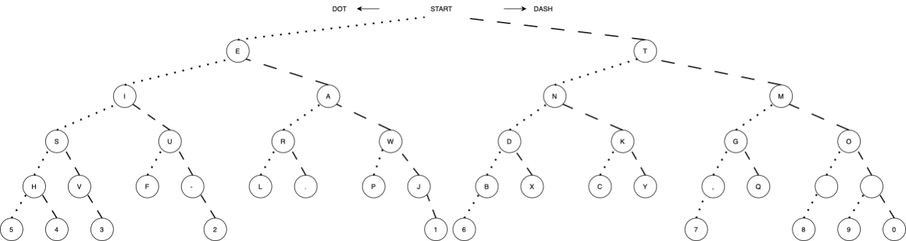
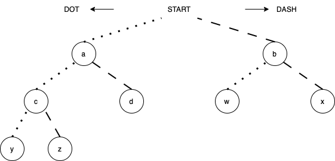

# custom-morse-code

Morse code, is designed such that the most frequently used letters have the shortest code. However, as many has pointed out, the ordering of such character frequencies based on common English text in the newspaper is not the most efficient. New frequency orders have been proposed, for example those based on Google Book's data and words in the Oxford Dictionary. 

This program is designed to take in any ordering of character frequency (and any characters, numbers, punctuations), and allow you to encode and decode text to your own binary code. For example, the International Morse Code ordering is roughly "etianmsurwdkgohvf-l,pjbxcyzq.&nbsp;&nbsp;54 3&nbsp;&nbsp;2&nbsp;&nbsp;&nbsp;&nbsp;&nbsp;&nbsp;&nbsp;16&nbsp;&nbsp;&nbsp;&nbsp;&nbsp;&nbsp;&nbsp;7&nbsp;&nbsp;&nbsp;8 90". Use space to denote skipped node of the binary tree.

<p align="center">
    
</p>

## Algorithm
Creating the encodings is similar to building up a binary tree given the breath-first search traversal, or the level order traversal, of the nodes/characters. Moving to the left sub tree is denoted with a dot ".", and moving to the right sub tree is a dash "-". 

<p align="center">
    
</p>

For example, given the custom ordering of letters "abcdwxyz", "a" is encoded as ".", "b" is encoded as "-", "d" is encoded as ".-", "z" is encoded as "..-" etc. For this encoding, "bad" is "- . .-", but if decoded with International Morse Code, it will read "tea".

The algorithm will only encode and decode the letters provided, any unknow characters will be translated to "?". 

### Usage
1. ```git clone``` the repository, and ```cd``` to directory
2. ```make output```
3. ```./output```
4. follow prompt from command line, and input custom ordering of letters
5. use "encode" or "decode" keywords followed by text or code to translate

## Case Study
Analyze ICAO codes for airports, and determine most frequently used characters.
https://github.com/ip2location/ip2location-iata-icao/blob/master/iata-icao.csv 
New proposed ordering
Compare efficiency, taking into consideration both bit size and spacing/length of signals 

## Opens
- [x] ITU Morse Code encode and decode
- [x] tree data structure to assign . and - to characters
  - [x] input custom ordering
- [ ] use encode and decode with new encodings
  - [x] variable letter and word spacing, not hard coded in decode()
  - [ ] faster search for decoding --> O(logn) if given binary tree
- [ ] command line interface 
- [ ] edge cases: check each letter provided in ordering is unique

## References 

* [Morse Code applications](https://eclecticlight.co/2015/10/20/the-code-lives-on-how-morse-is-still-not-dead/)
* [Alternate Morse Codes](https://eclecticlight.co/2015/10/22/reinventing-morse-code-using-modern-theory/)
* [ITU Morse Code Standards](https://www.itu.int/dms_pubrec/itu-r/rec/m/R-REC-M.1677-1-200910-I!!PDF-E.pdf)
* [Letter frequency based on Google Book's data](http://norvig.com/mayzner.html)
* [Letter frequency based on Oxford Dictionary](https://www3.nd.edu/~busiforc/handouts/cryptography/letterfrequencies.html)